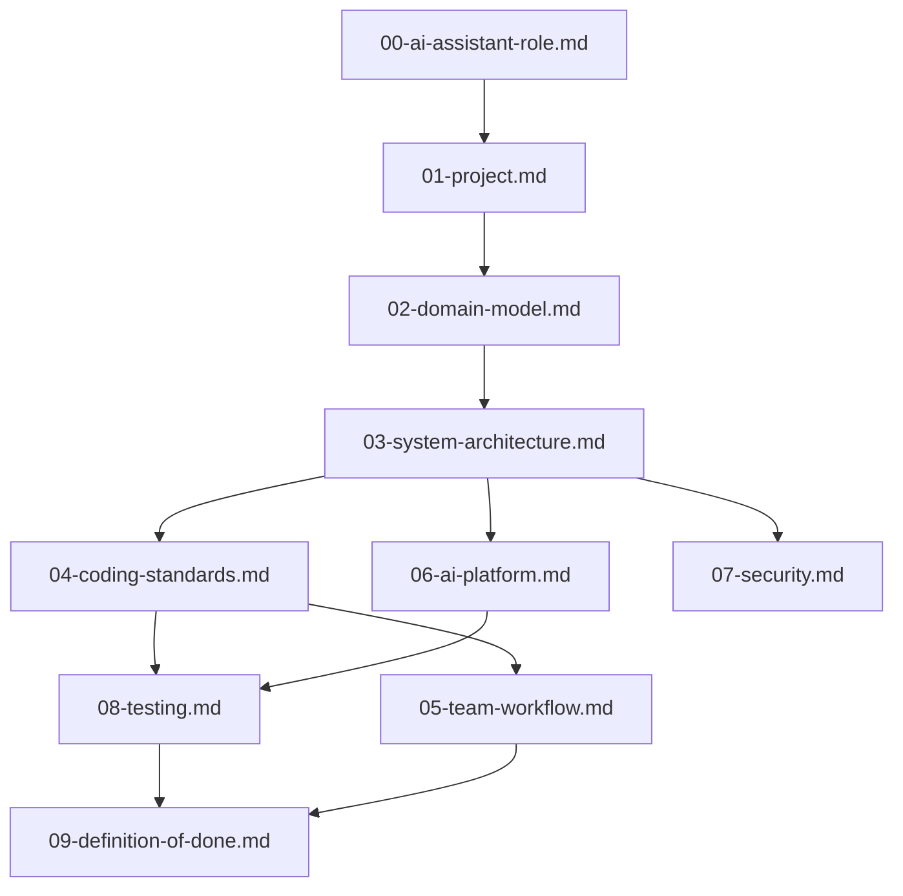

# Design Document: Project Steering Foundation

## Overview

The Project Steering Foundation establishes a structured hierarchy of steering files that guide development practices across the Modern AI Agent Platform. This system creates authoritative documentation in the `.kiro/steering/` directory that serves as a reference for both human developers and AI assistants.

### Purpose

Steering files provide project-wide guidance on architectural decisions, coding standards, domain concepts, and development workflows. Unlike implementation code or feature specifications, steering files establish **patterns, principles, and processes** that evolve with the project. They form a knowledge base that answers "how should we build this?" and "what conventions do we follow?"

### Design Principles

1. **Single Responsibility**: Each steering file addresses one specific concern
2. **Reference Over Duplication**: Files reference each other using `#[[file:name.md]]` syntax instead of repeating content
3. **Generic Foundation**: Content is general enough to evolve as the project matures
4. **Technology-Aligned**: Guidance reflects the actual technology stack and monorepo structure
5. **Scope Boundary**: Focus on guidance and patterns, not implementation details

## Architecture

### File Structure

The steering system consists of ten files in `.kiro/steering/`, numbered for logical reading order:

```
.kiro/steering/
├── 00-ai-assistant-role.md     # AI assistant behavior and guidelines
├── 01-project.md               # Vision, goals, scope
├── 02-domain-model.md          # Business concepts and terminology
├── 03-system-architecture.md   # Technical design and stack
├── 04-coding-standards.md      # Code style and quality rules
├── 05-team-workflow.md         # Development process
├── 06-ai-platform.md           # AI agent patterns
├── 07-security.md              # Security policy
├── 08-testing.md               # Testing strategy
└── 09-definition-of-done.md    # Completion criteria
```

### Dependency Graph



### Cross-Reference Pattern

Files use `#[[file:filename.md]]` syntax to reference related guidance:

- **03-system-architecture.md** references `#[[file:02-domain-model.md]]` for domain terminology
- **04-coding-standards.md** references `#[[file:03-system-architecture.md]]` for technology-specific conventions
- **08-testing.md** references `#[[file:04-coding-standards.md]]` for test code style
- **05-team-workflow.md** references `#[[file:09-definition-of-done.md]]` for completion criteria
- **09-definition-of-done.md** references `#[[file:08-testing.md]]` for testing requirements

## Components and Interfaces

### 00-ai-assistant-role.md: AI Assistant Role

**Responsibility**: Define how AI assistants (like Kiro) should behave, communicate, and make decisions when working in this repository.

**Content Includes**:
- AI assistant's role in the three-developer team
- Communication style guidelines (concise, technical, proactive)
- Decision-making guidelines (when to act vs. ask)
- Autonomy boundaries (what can be done without confirmation)
- Code generation expectations (style, completeness, testing)
- Documentation expectations (what to document, when to document)
- Testing expectations (when to write tests, what types of tests)
- Collaboration patterns (how to work with human developers)
- Error handling behavior (how to respond to ambiguity or failure)

**Content Excludes**:
- Specific code implementations (belongs in codebase)
- General project identity (belongs in 01-project.md)
- Technical architecture decisions (belongs in 03-system-architecture.md)
- Specific coding standards (belongs in 04-coding-standards.md)

**Referenced By**: All other steering files implicitly depend on this foundational behavioral guidance

### 01-project.md: Project Identity

**Responsibility**: Define the platform's vision, mission, goals, and scope boundaries.

**Content Includes**:
- Mission statement (what problem the platform solves)
- Primary goals (what success looks like)
- Scope definition (what is in scope and what is explicitly out of scope)
- Target users and use cases
- Strategic direction

**Content Excludes**:
- Implementation details
- Specific feature requirements
- Technical architecture decisions (belongs in 03-system-architecture.md)

**Referenced By**: 02-domain-model.md (for business context)

### 02-domain-model.md: Domain Model

**Responsibility**: Define business concepts, entities, and terminology for the AI Agent Platform domain.

**Content Includes**:
- Key business entities (Agent, User, Conversation, Task, Tool, etc.)
- Entity relationships (Agent executes Tasks, User creates Conversations, etc.)
- Domain glossary with clear definitions
- Distinction between AI agent concepts, user concepts, and system concepts
- Conceptual models and diagrams

**Content Excludes**:
- Database schema or data models (belongs in feature specifications)
- API endpoint definitions (belongs in 03-system-architecture.md)
- UI component structure (belongs in 03-system-architecture.md)

**References**: 01-project.md (for business context)

**Referenced By**: 03-system-architecture.md, 06-ai-platform.md

### 03-system-architecture.md: System Architecture

**Responsibility**: Document technical design, technology stack, and architectural patterns.

**Content Includes**:
- Monorepo structure (backend and frontend directories)
- Backend technology stack (FastAPI, Python 3.12, Pydantic, pytest)
- Frontend technology stack (Next.js 16, React 19, TypeScript, TanStack Query, React Hook Form, Zod, Tailwind CSS)
- Communication patterns (REST API, request/response flow)
- Architectural patterns (layered architecture, dependency injection, separation of concerns)
- Module organization (app structure, routing, configuration)
- Configuration management (MAAP_ environment variable prefix)

**Content Excludes**:
- Specific feature implementations
- Code style rules (belongs in 04-coding-standards.md)
- Security implementation details (belongs in 07-security.md)

**References**: #[[file:02-domain-model.md]] for domain terminology

**Referenced By**: 04-coding-standards.md, 06-ai-platform.md, 07-security.md

### 04-coding-standards.md: Coding Standards

**Responsibility**: Define code style, structure, and quality conventions.

**Content Includes**:
- Python conventions (PEP 8, type hints, docstrings, import ordering)
- TypeScript conventions (strict mode, type safety, functional patterns)
- React conventions (functional components, hooks usage, component structure)
- Naming conventions (files, functions, classes, variables, constants)
- Module organization and file structure
- Code quality requirements (type safety, error handling, documentation)
- Formatting rules (line length, indentation, spacing)

**Content Excludes**:
- Technology stack decisions (belongs in 03-system-architecture.md)
- Testing requirements (belongs in 08-testing.md)
- Git workflow (belongs in 05-team-workflow.md)

**References**: #[[file:03-system-architecture.md]] for technology-specific conventions

**Referenced By**: 05-team-workflow.md, 08-testing.md

### 05-team-workflow.md: Team Workflow

**Responsibility**: Define development process and collaboration practices.

**Content Includes**:
- Branching strategy (feature branches, main branch protection)
- Commit message format (conventional commits)
- Pull request process (creation, review, approval)
- Code review criteria (what reviewers check)
- Dependency management (adding packages, version pinning)
- Environment setup procedures
- Development server commands

**Content Excludes**:
- Code style rules (belongs in 04-coding-standards.md)
- Testing strategy (belongs in 08-testing.md)
- Security policies (belongs in 07-security.md)

**References**: #[[file:04-coding-standards.md]] for code quality requirements, #[[file:09-definition-of-done.md]] for completion criteria

**Referenced By**: 09-definition-of-done.md

### 06-ai-platform.md: AI Platform Patterns

**Responsibility**: Define patterns specific to AI agent architecture and LLM integration.

**Content Includes**:
- AI agent architecture patterns (agent types, capabilities, tool use)
- LLM integration patterns (API clients, prompt management, token handling)
- Multi-agent coordination patterns (communication, task delegation, state sharing)
- Prompt engineering guidelines (structure, context management, output formatting)
- Error handling for AI-generated content (hallucination detection, fallback strategies)
- Rate limiting and cost management

**Content Excludes**:
- General system architecture (belongs in 03-system-architecture.md)
- Security policy for API keys (belongs in 07-security.md, but 06 references it)
- Testing AI behavior (belongs in 08-testing.md, but 06 informs test strategies)

**References**: #[[file:02-domain-model.md]] for AI agent terminology, #[[file:03-system-architecture.md]] for integration points

**Referenced By**: 08-testing.md (for AI-specific test patterns)

### 07-security.md: Security Policy

**Responsibility**: Define security requirements and data protection rules.

**Content Includes**:
- API key and secret management (environment variables, never in code)
- Authentication patterns (user authentication, API authentication)
- Authorization patterns (role-based access, permission checks)
- Input validation and sanitization requirements
- Configuration security (MAAP_ prefix, .env files, .gitignore)
- Data privacy classification (what data is sensitive)
- Compliance requirements

**Content Excludes**:
- Implementation of authentication (belongs in feature specifications)
- Database encryption details (belongs in feature specifications)
- Specific security vulnerabilities or patches (belongs in issue tracking)

**References**: #[[file:03-system-architecture.md]] for configuration patterns

**Referenced By**: 06-ai-platform.md (for LLM API key handling), 08-testing.md (for security testing)

### 08-testing.md: Testing Strategy

**Responsibility**: Define testing approach, coverage requirements, and quality gates.

**Content Includes**:
- Test coverage requirements (minimum percentages, critical path coverage)
- Test types and when to use each:
  - Unit tests (pure functions, business logic)
  - Integration tests (API endpoints, database interactions)
  - Property-based tests (universal properties across inputs)
  - End-to-end tests (user workflows)
- Testing tools (pytest for backend, frontend testing framework)
- Quality gates (when tests must pass)
- AI agent testing patterns (mocking LLM responses, testing tool execution)
- Test organization and naming conventions

**Content Excludes**:
- Code style for production code (belongs in 04-coding-standards.md)
- CI/CD pipeline configuration (belongs in 05-team-workflow.md)
- Specific feature test cases (belongs in feature specifications)

**References**: #[[file:04-coding-standards.md]] for test code style, #[[file:06-ai-platform.md]] for AI testing patterns

**Referenced By**: 09-definition-of-done.md

### 09-definition-of-done.md: Definition of Done

**Responsibility**: Define explicit completion criteria for features and releases.

**Content Includes**:
- Feature completion criteria:
  - All acceptance criteria met
  - Code reviewed and approved
  - Tests written and passing
  - Documentation updated
  - No known critical bugs
- Bug fix completion criteria:
  - Root cause identified
  - Fix implemented and tested
  - Regression test added
- Release completion criteria:
  - All features and fixes complete
  - Performance benchmarks met
  - Security review completed
  - Documentation complete
- Documentation requirements by work type
- Testing requirements by work type

**Content Excludes**:
- Specific acceptance criteria for features (belongs in feature specifications)
- Testing strategy details (belongs in 08-testing.md)
- Code review process (belongs in 05-team-workflow.md)

**References**: #[[file:08-testing.md]] for testing requirements, #[[file:05-team-workflow.md]] for review process

**Referenced By**: 05-team-workflow.md

## Data Models

### Steering File Structure

Each steering file follows this markdown structure:

```markdown
# [Number]-[Name]: [Title]

## Purpose

[Why this file exists and what guidance it provides]

## [Section 1]

[Content organized by logical sections]

## [Section 2]

[Content with cross-references to other steering files]

## References

- #[[file:other-file.md]] - [Why this reference is relevant]
```

### Cross-Reference Syntax

The system uses a simple link syntax for cross-references:

```markdown
See #[[file:02-domain-model.md]] for entity definitions.
```

This creates a navigable reference that AI assistants and developers can follow.

### Content Classification

**Patterns**: Repeatable solutions to common problems
- Example: "Use functional components with hooks for React UI"

**Principles**: Foundational design philosophies
- Example: "Separate domain logic from infrastructure concerns"

**Processes**: Step-by-step workflows
- Example: "Create feature branch → implement → test → PR → review → merge"

**Standards**: Explicit rules and conventions
- Example: "Use snake_case for Python functions, camelCase for TypeScript"

## Error Handling

### Missing Cross-References

When a steering file references another file using `#[[file:name.md]]`, the referenced file must exist in `.kiro/steering/`. During development:

- AI assistants should validate cross-references
- Missing references should be flagged as errors
- Developers should create referenced files before finalizing

### Circular References

Avoid circular dependencies where File A references File B and File B references File A. The dependency graph should be acyclic. If circular references are necessary, use one-directional references and note the relationship in comments.

### Scope Violations

If a steering file begins to include implementation code or specific feature requirements, this is a scope violation. Such content should be moved to:

- Feature specifications (in `.kiro/specs/feature-name/`)
- Implementation code (in `backend/` or `frontend/`)
- Architecture Decision Records (if the project adopts ADRs)

### Duplication Detection

When content appears in multiple steering files, evaluate:

1. Is this a cross-reference opportunity? One file should own the content, others reference it.
2. Is the content truly different in each context? Then duplication may be acceptable.
3. Is this revealing a missing abstraction? Consider creating a new steering file.

## Testing Strategy

### Property-Based Testing Applicability

This feature is **NOT suitable for property-based testing** because:

1. Steering files are documentation artifacts, not executable code
2. The "correctness" of steering files is subjective and context-dependent
3. There are no universal properties that hold across all steering file content
4. Quality is evaluated through human review, not automated tests

### Appropriate Testing Strategies

**Human Review**:
- Developers review steering files for clarity, completeness, and accuracy
- AI assistants evaluate whether guidance is actionable
- Domain experts validate domain model terminology

**Cross-Reference Validation**:
- Automated checks verify that `#[[file:name.md]]` links point to existing files
- Tooling can detect broken references in pull requests

**Scope Checking**:
- Code reviews ensure steering files don't contain implementation details
- Checklists verify each file adheres to its single responsibility

**Example-Based Testing**:
- Create specific test scenarios: "Does the coding standards file address Python type hints?"
- Validate presence of required sections in each file
- Check that technology stack references match actual dependencies

**Integration Testing**:
- Test that AI assistants can successfully parse and use steering file guidance
- Verify that developers can navigate cross-references
- Confirm that steering files integrate with existing documentation

### Test Coverage Goals

- 100% of cross-references validated (automated)
- 100% of required sections present in each file (automated)
- Manual review by at least one developer per file
- Manual review by AI assistant to ensure guidance is interpretable

### Testing Tools

- **Markdown linters**: Check syntax and structure
- **Link checkers**: Validate cross-references
- **Custom scripts**: Verify section presence and naming conventions
- **AI assistant validation**: Attempt to use guidance in realistic scenarios

## Usage by AI Assistants

When an AI assistant (like Kiro) works on the Modern AI Agent Platform:

1. **Initialize**: The assistant first reads `00-ai-assistant-role.md` to understand its behavioral guidelines
2. **Discovery**: The assistant reads `.kiro/steering/` to understand project conventions
3. **Navigation**: The assistant follows `#[[file:name.md]]` references to related guidance
4. **Decision-Making**: The assistant uses steering files to make implementation choices
   - "How should I behave in this repository?" → Check 00-ai-assistant-role.md
   - "How should I name this function?" → Check 04-coding-standards.md
   - "What architecture pattern should I use?" → Check 03-system-architecture.md
   - "How do I test AI agent behavior?" → Check 08-testing.md and 06-ai-platform.md
5. **Validation**: The assistant verifies its work against steering file requirements
6. **Evolution**: The assistant may suggest steering file updates when patterns emerge

## Usage by Developers

When a developer works on the Modern AI Agent Platform:

1. **Onboarding**: New developers read steering files to understand project conventions
2. **Reference**: Developers consult steering files when making decisions
3. **Code Review**: Reviewers reference steering files to evaluate pull requests
4. **Evolution**: Developers propose updates to steering files as the project matures

## Future Extensions

### Skills and Hooks

Future Kiro Skills and Hooks can build on steering files:

- **Code Generation Skills**: Read 04-coding-standards.md to generate compliant code
- **Architecture Review Hooks**: Validate changes against 03-system-architecture.md
- **Security Scan Hooks**: Check commits against 07-security.md requirements
- **Test Generation Skills**: Use 08-testing.md to create appropriate test cases

### Steering File Templates

As patterns emerge, steering file templates can be created for:

- New projects adopting similar technology stacks
- Specialized domains (e.g., "08-ai-platform.md" as a template for AI projects)
- Organization-wide standards

### Steering File Versioning

If steering files require versioning:

- Add version headers (e.g., `Version: 1.0`)
- Track changes in git history
- Use branches for major steering policy changes

### Dynamic References

Future tooling could support dynamic queries:

```markdown
See #[[query:files mentioning "authentication"]] for auth-related guidance.
```

This would enable more flexible navigation as the steering file system grows.

## Summary

The Project Steering Foundation creates a structured, cross-referenced system of ten steering files that guide development across the Modern AI Agent Platform. The foundation begins with `00-ai-assistant-role.md`, which defines how AI assistants should behave when working in the repository. Each file has a single clear responsibility, references related guidance instead of duplicating content, and focuses on patterns and principles rather than implementation details. This foundation enables both human developers and AI assistants to make consistent, informed decisions as they build the platform.
